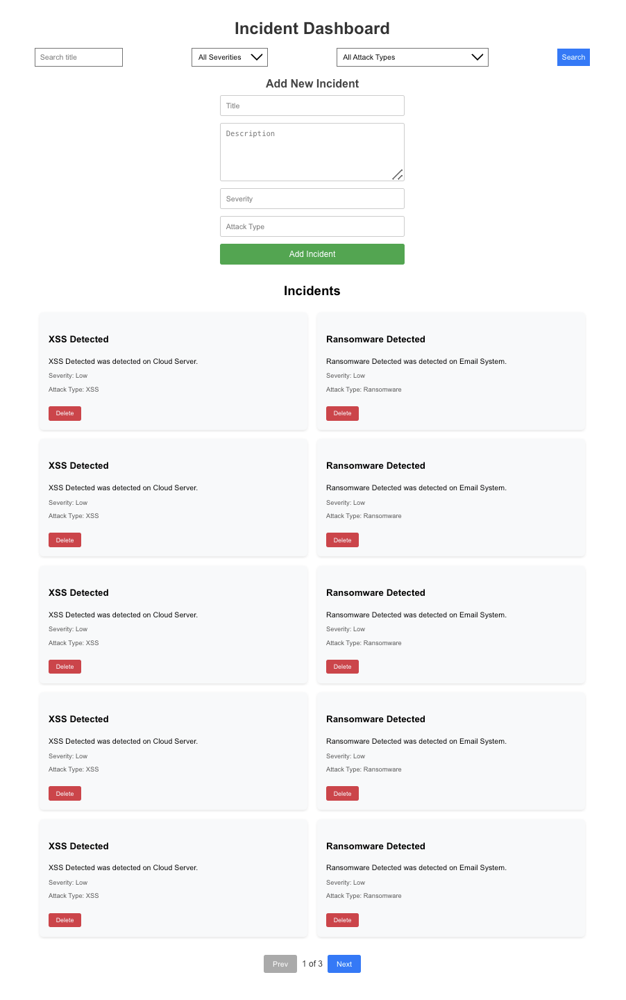

# Cybersecurity Dashboard

This project is a dashboard for managing and searching security incident data using Elasticsearch, FastAPI, and React.js. It provides a powerful search interface and allows you to efficiently manage and analyze security vulnerabilities and incidents.


## Prerequisites

Before setting up the project, ensure you have the following installed:

- Docker and Docker Compose
- Node.js and npm
- Python 3.8+ and pip
- Basic knowledge of command-line tools

## Setting Up the Environment

1. **Clone the repository**
  ```bash
  cd cybersecurity_dashboard-elasticsearch
  ```

2. **Launch Elasticsearch using Docker**
  ```bash
  docker pull docker.elastic.co/elasticsearch/elasticsearch:8.9.1
  docker run -d --name elasticsearch -p 9200:9200 -e "discovery.type=single-node" elasticsearch:8.9.1

  Note: Make sure to update the elasticsearch password
  ```

3. **Verify elasticsearch is running**
  ```bash
  curl -X GET "localhost:9200"
  ```

3. **Set up the backend**
  ```bash
  python3 -m venv .
  source bin/activate
  pip install -r requirements.txt
  uvicorn main:app --reload --port 8001
  ```
        
4. **Set up the frontend**
  ```bash
  npm install
  npm start
  ```

5. **Access the dashboard**
  ```bash
  http://localhost:3000
  ```


**Features in Detail**

- Elasticsearch Optimization
Implemented sharding and replication for improved performance and high availability.
Use Elasticsearch’s aggregation capabilities for summarized data insights, such as counting incidents by severity or attack type.

- Large Dataset Integration
Integrated large datasets by importing security incidents from public data sources
Set up automated scripts to download and index new data periodically.

- Advanced Search Functionality
Used fuzzy matching for better search results in incident titles and descriptions.
Enhance search functionality with advanced filters, such as severity and attack type

- Incident Management
The backend supports creating and deleting incidents.
Bulk upload incidents using the Elasticsearch bulk API with data in JSON formats.

- Endpoint to plug in realtime SOC data such as incidents, vulnerabilities, new CVEs, etc.

- Refreshes every minute so that the data and incidents are up to date

- There are two approaches taken in this implementation to show a proof of concept of both
  a. To create an endpoint where an external API can be plugged in, for eg data from an online CVE database
  b. Randomly generated local data that is large in size (~50,000) to show the capacity and performance


**Why Elasticsearch for this scenario**

- High-Performance Search and Analytics
- Real-Time Data Ingestion
- Scalability
- Advanced Querying and Aggregations
- Future extensions like alerts and automation with Kibana


**Snapshot of the dashboard**

